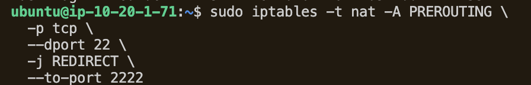
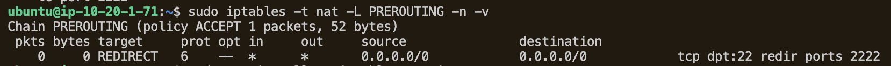

# AWS Cowrie Honeypot For Attack Telemetry and Threat Analysis
An AWS-hosted honeypot that acts as a deliberately misconfigured site for self-study and analysis of live attack traffic. 

## Overview  
A cloud based honeypot environment deployed on AWS via Terraform 
Designed to capture , monitor and analyse SSH login activity while keeping real administrative SSH access from the honeypot for analysis and monitoring. 

Deployed on an isolated cloud VM and intentionally exposed to attract automated scans, brute-force attempts and other hostile activity. 

Typical honeypot projects use T-pot, an all in one platform. However, as I wanted to understand the individual components involved by building it manually: 
- Honeypot deployment
- Network security
- Loggin
- Monitoring
- Threat analysis

## Objective 
The project aims to collect attacker telemetry such as: 
- Source IP
- Attempted usernames and paswords
- Commands entered in sessions
- Connection timestamps
- Other behavioural information

Log information is viewed via JSON. 

Updated: Collected logs are then forwarded to central monitoring platform (CloudWatch) for analysis. 

This project was intended for learning and research into malicious activitty and for gaining practical experience with cloud, Linux, threat monitoring and security analysis

## Key Features

**SSH/Telnet attack monitoring**
- Uses Cowrie to emulate SSH and Telnet services.
- Captures authentication attempts and interactive attacker sessions.

**Credential attempt logging**
- Records usernames and passwords attempted by remote hosts.
- Allows analysis of commonly targeted credentials.

**Command and session monitoring**
- Records commands entered by attackers after connecting to the honeypot.
- Provides insight into attacker behaviour and post-compromise activity.

**Source IP tracking**
- Logs the IP addresses of systems connecting to the honeypot.
- Enables identification of repeated scanners and attack sources.

**Structured JSON logging**
- Uses structured honeypot logs to simplify searching, parsing, and analysis.

**Cloud log monitoring**
- Honeypot logs can be forwarded to services such as AWS CloudWatch for analysis

**Attack visualisation**
- attack frequency
- source IP addresses
- attempted usernames
- attempted passwords
- attacker commands
- geographic distribution
- attack trends over time

## Project Structure

## Project Process
### AWS IAM Configuration
Terraform configuration was applied via a dedicated terraform-user IAM role. Permissions were added based on the following resources required for this project: 
- VPC 
- Subnet
- IGW
- Route Table
- Security group
- EC2
- Key pair
- IAM role 

Separation of policies is required to separate responsibilities for any user. This makes it easier for removal and inspection of roles if issues arise. 

``` bash 
terraform-user
│
├── Honeypot-Networking
│    └── VPC, subnet, route table, IGW, SG
│
├── Honeypot-EC2
│    └── instance, key pair, volumes
│
└──  Honeypot-IAM
     └── only the project EC2 role/profile
``` 
This is important as the Honeypot is a deliberate attack surface which is exposed. Restricting the IAM role here is critical. 


### AWS EC2 Configuration 
AWS infrastrcuture was provisioned using Terraform. 
Resources include: 
- Dedicated VPC
- Public subnet
- Internet Gateway
- Public route table
- Security Group
- Ubuntu EC2 instance
- EC2 SSH key pair
- IAM role and instance profile


This project was completed using a dedicated AWS IAM user, terraform-user, with infrastructure permissions separated by service and responsibility. The EC2 honeypot uses a separate IAM role with limited runtime permissions specified in iam.tf. 

- **HoneypotTerraformEC2Policy** – manages the EC2 instance, AMI lookups, volumes, key pairs, and required EC2 read operations.
- **HoneypotTerraformNetworkPolicy** – manages the VPC, subnet, Internet Gateway, route tables, and Security Group rules.
- **HoneypotTerraformIAMPolicy** – allows Terraform to manage only the honeypot IAM role and instance profile, including restricted `iam:PassRole` access to EC2.


### Cowrie
As the core honeypot component, it emulates an SSH service so attackers and automated scanners interact with a controlled fake environment. It records useful telemetry which can then be analysed. 

Cowrie runs under a dedicated non priviledged Linux user

```bash
sudo adduser --disabled-password cowrie
```

A Python virtual environment is used for the Cowrie installation:

```bash
mkdir ~/honeypot
cd ~/honeypot

python3 -m venv cowrie-env
source cowrie-env/bin/activate

pip install --upgrade pip
pip install cowrie
```
Cowrie is initialized and started with:

```bash
cowrie init
cowrie start
cowrie status
```

Cowrie listens internally on TCP port `2222`.

Initally, the Ubuntu OpenSSH service was working from port 22. Then it was moved to port 22222. This prevents public SSH traffic intended for the honeypot from reaching the real administrative SSH service.

I then redirected incoming traffic on the normal SSH port is redirected to Cowrie:

```bash
sudo iptables -t nat -A PREROUTING -p tcp --dport 22 -j REDIRECT --to-port 2222
```


The redirect can be verified with:

```bash
sudo iptables -t nat -L PREROUTING -n -v
```


Testing was done locally from the EC2 instance. This command attempts administrative connection after the redirect: 

```bash
ssh -p 2222 root@127.0.0.1
```

Testing was also done externally from another machine (terminal):

```bash
ssh root@127.0.0.1
```
The external connection should reach Cowrie rather than the real OpenSSH service.


### Network Configuration 
I intended to create a private VPC and public subnet. 

Separation of the SSH port to ensure that specified ports are isolated to the attacking surface, whilst another port is restricted to the administrator's public IP using the AWS Security group. 

**VPC: 10.20.0.0/16**

**Public Subnet: 10.20.1.0/24**

**Port 22: Public honeypot SSH**

**Port  2222: Internal Cowrie SSH listener**

**Port 22222: Administrative openSSH**

### Accessing Command Logs
Initally, the command logs output by Cowrie were difficult to read in raw format. 
Installing ***jq***  allowed the logs to be formatted into a structured view, looking at information such as source IPs, login attempts, attacker commands. 


### Log ship to CloudWatch (Future Implementation)
### Building Dashboard
### Future Improvements


